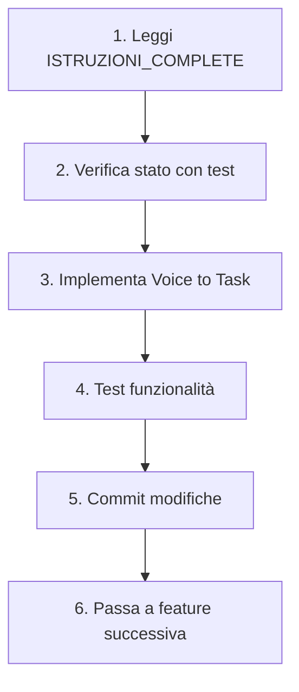

# 📚 INDICE DOCUMENTAZIONE SONNET

## 🎯 GUIDA RAPIDA PER INIZIARE

**Ciao Sonnet!** Questa è la documentazione completa per continuare lo sviluppo dell'app Beweb Tirocinio.

### 🚀 DA DOVE INIZIARE

1. **PRIMA LEGGI:** `ISTRUZIONI_COMPLETE_PER_SONNET.md` - Contiene TUTTO il contesto del progetto
2. **POI LEGGI:** I file specifici delle funzionalità da implementare (vedi sotto)
3. **INFINE:** Procedi con l'implementazione seguendo le priorità indicate

## 📁 STRUTTURA DOCUMENTAZIONE

### 📋 File Principali (LEGGERE IN ORDINE)

| File | Descrizione | Priorità Lettura |
|------|-------------|------------------|
| `ISTRUZIONI_COMPLETE_PER_SONNET.md` | Contesto completo del progetto, architettura, regole critiche | **🔴 CRITICA** |
| `HANDOVER_TO_SONNET.md` | Cosa NON toccare, pattern da seguire, recovery plan | **🔴 CRITICA** |
| `CURRENT_STATE_SNAPSHOT.md` | Stato attuale funzionante, test da eseguire | **🟡 ALTA** |
| `AI_SMART_FOCUS_SETUP.md` | Documentazione servizio Smart Focus AI | **🟢 MEDIA** |

### 🛠️ Funzionalità da Implementare

| File | Funzionalità | Priorità | Difficoltà | Tempo Stimato |
|------|--------------|----------|------------|---------------|
| `01_VOICE_TO_TASK.md` | Input vocale per creare task rapidamente | **🔴 ALTA** | ⭐⭐⭐ Media | 3-4 ore |
| `02_TASK_BREAKDOWN_AI.md` | Scompositore automatico task complessi | **🟡 MEDIA** | ⭐⭐⭐⭐ Alta | 4-5 ore |
| `03_DAILY_RECAP_EMAIL.md` | Email riassuntiva giornaliera con AI | **🟢 BASSA** | ⭐⭐ Facile | 2-3 ore |
| `04_PATTERN_INSIGHTS.md` | Dashboard analytics produttività | **🟢 BASSA** | ⭐⭐⭐⭐⭐ Molto Alta | 6-8 ore |

## 🔄 WORKFLOW CONSIGLIATO



## ⚠️ REGOLE D'ORO

1. **MAI MODIFICARE:**
   - `bootstrap.php`
   - `BaseAIService.php`
   - `.htaccess` files

2. **SEMPRE TESTARE:**
   ```bash
   php test_smart_focus.php
   php test_login.php
   ```

3. **API KEYS:**
   - ❌ MAI in `.env`
   - ✅ SEMPRE in database `ai_settings`

## 🧪 TEST RAPIDI

### Test Base Funzionamento
```bash
cd C:\laragon\www\tirocinio\beweb-app
php test_smart_focus.php  # Deve mostrare 3 task
php test_login.php        # Deve dire "Login successful"
```

### Test UI Browser
1. Apri: `http://localhost/tirocinio/public_html/`
2. Login: `mario@example.com` / `password123`
3. Verifica Smart Focus funzioni
4. Controlla console (F12) per errori

## 📊 STATO ATTUALE PROGETTO

### ✅ Funzionalità Complete
- Sistema autenticazione
- CRUD Task completo
- Smart Focus AI con OpenAI
- Import da Google Tasks
- Gestione progetti
- Time tracking

### 🚧 In Sviluppo
- Voice to Task (01)
- Task Breakdown AI (02)
- Daily Recap Email (03)
- Pattern Insights (04)

### 🐛 Bug Noti
- Import Google Tasks non assegna project_id automaticamente
- Alcune traduzioni IT/EN miste nell'UI

## 💡 SUGGERIMENTI PER SONNET

### Quando Implementi Voice to Task
- Usa Whisper API per trascrizione
- Implementa fallback se microfono non disponibile
- Aggiungi indicatore visivo durante registrazione
- Max 2 minuti per registrazione

### Quando Implementi Task Breakdown
- Permetti diversi livelli di granularità
- Mostra preview prima di confermare
- Crea subtask come task normali con parent_id

### Quando Implementi Daily Recap
- Invia alle 18:00 di default
- Permetti customizzazione orario
- Includi solo task del giorno

### Quando Implementi Pattern Insights
- Usa Chart.js (già disponibile)
- Calcola metriche lato server per performance
- Cache risultati per 1 ora

## 🆘 SE QUALCOSA SI ROMPE

### Smart Focus non funziona
```php
// In app/Controllers/AIController.php
// Cambia da:
$service = new AISmartFocusService();
// A:
$service = new ADHDSmartFocusService();
```

### Login non funziona
```bash
php test_login.php
```

### UI Bootstrap rotta
Verifica in `app/Views/layouts/base.php`:
```html
<!-- Deve essere 5.3.0 -->
<link href="https://cdn.jsdelivr.net/npm/bootstrap@5.3.0/dist/css/bootstrap.min.css">
```

## 📝 NOTE IMPORTANTI

1. **Utente è italiano** - Commenta in italiano
2. **Target ADHD** - UI deve essere semplice e immediata
3. **No jQuery** - Usa vanilla JS
4. **No framework PHP** - Pure PHP con pattern MVC custom
5. **Database:** `beweb_app` (NON beweb_tirocinio!)

## 🎯 OBIETTIVO FINALE

L'app deve aiutare persone con ADHD a:
- Superare la paralisi decisionale
- Mantenere focus su task importanti
- Catturare idee al volo
- Analizzare pattern produttività
- Lavorare con tecniche Pomodoro

---

**IMPORTANTE:** Questo è un progetto reale in produzione. Testa sempre ogni modifica prima di procedere con la successiva. L'utente si aspetta codice funzionante, non bozze o placeholder.

Buon lavoro! 💪